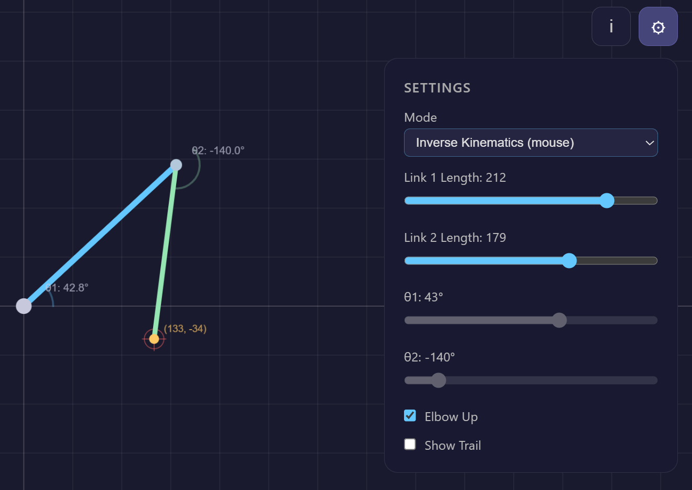

# 2D Robot Arm Simulator

Interactive 2-link robot arm simulator for exploring forward and inverse kinematics. Built with p5.js and served by Deno.



## Run

```
deno task dev
```

Open http://localhost:8000
